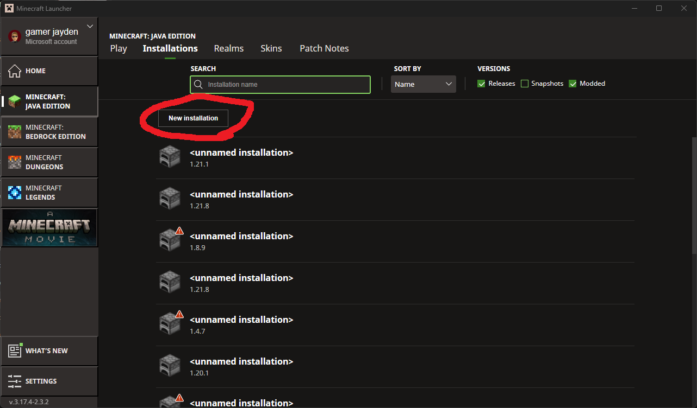

# Install
1. Grab yourself the [Forge 1.8.9](https://files.minecraftforge.net/net/minecraftforge/forge/index_1.8.9.html) installer and install client.

2. Download this repo and save it under `%appdata%\.minecraft\installations\Skyclient`. If you change this path take note of it.

3. Click into `Installations` in the minecraft client, and create a new Installation

4.
   A. Set the release to the forge version you just installed

   B. Set the game directory to the directory you set in step 2.

   C. Set the game's ram to 4G if available. If you don't have 8gb of ram then skip this step.

5. Run the install in the client

